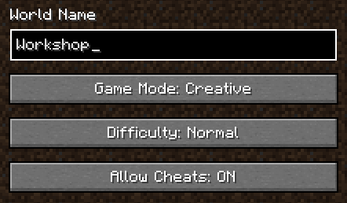
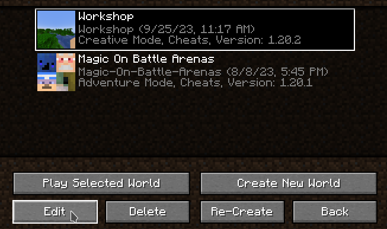
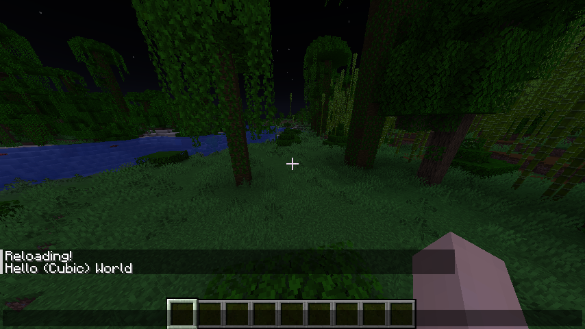
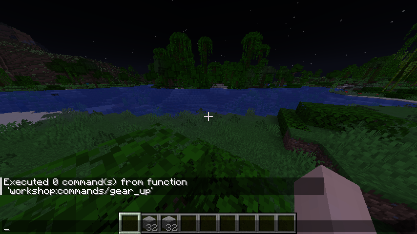
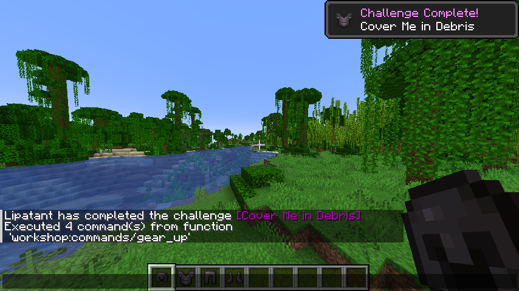
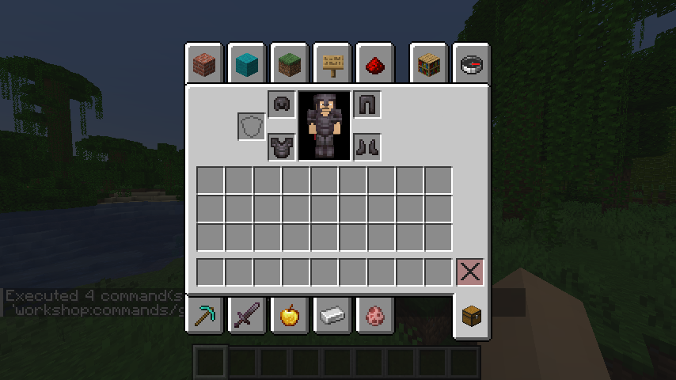
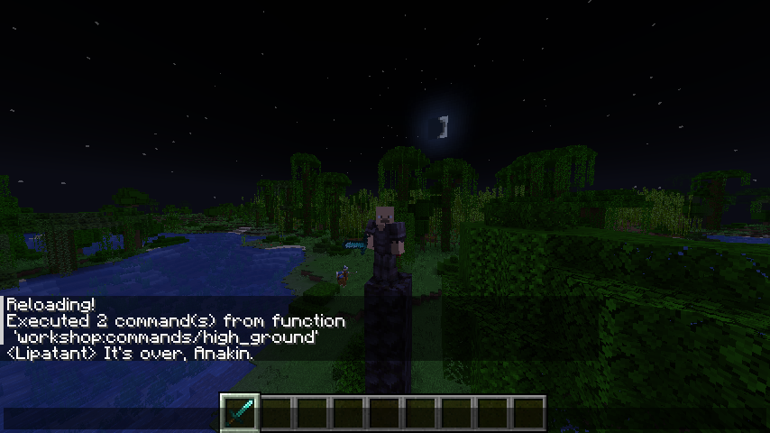
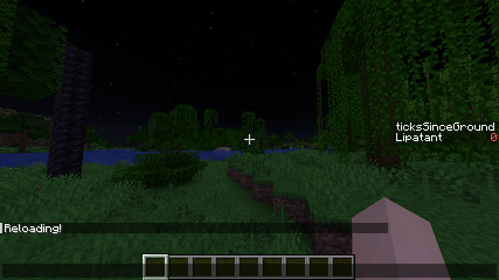
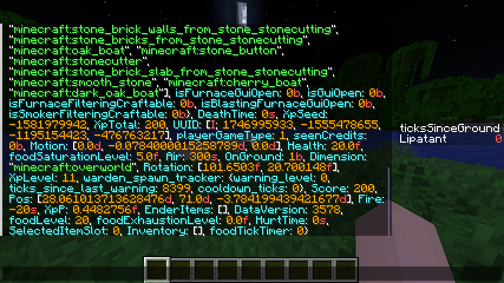
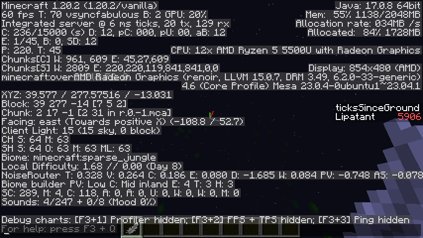

# WorkshopDatapackMinecraft

## Launching Minecraft

We'll assume you already own Minecraft (legally).

Launch Minecraft in the **lastest version**. This is important since Datapack formating is reguarly update.


Now, you can create a new world in Singleplayer.


Set Game Mode to Creative and the **Allow Cheats to ON**. This is also important since you need to have cheats to use `/reload` and `/function`



## Installing the Datapack

### **Directory**

Once your world is created, you can open the world's folder.

If you don't know where it is, you can go in Singleplayer, then select your world and edit it. You'll be able to click on **Open World Folder**




If it still doesn't work, you can go directly to your directory `~/.minecraft/saves/Workshop/`.

### **Import**

Now that you're in the right folder, go in `datapacks/` and import the given `WorkshopDatapack` folder.

If you have troubles, you can consult the following page [Tutorials/Installing a data pack](https://minecraft.wiki/w/Tutorials/Installing_a_data_pack).

### **Testing the dapack**

You can now test if everything is working correctly. But before that, use the `/reload` command (in the in-game chat). You'll have to use this command after every change on your code.

Now, you can use `/datapack list` and check if `[file/WorkshopDatapack (world)]` appears.


## 1 - Hello, Goodbye

Simple, or is it? If you go in `datapacks/WorkshopDatapacks/data/workshop/`**functions**`/`, you'll find two files:

`load.mcfunction`, executed everytime you use `/reload`.

`tick.mcfunction`, executed at every in-game tick, **20 times** per seconds.

What we are trying to achieve here is a message displayed everytime you use `/reload`. For that, we need to add a new command in `/reload`.

### **Displaying something**

Use the `/help tellraw` command. It will give use more info on how to use the `tellraw` command. If you need even more info about it, I suggest using this page [Commands/tellraw](https://minecraft.wiki/w/Commands/tellraw).

Both of these methods learn us something: we need "`tellraw`", a target and a message. Your name should be enough for now as a target.

It gives us `tellraw YOURNAME "a message"`. This should be enough for now.

Add it to your `load.mcfunction` file. Use `/reload` and what do we get?



### **Using selectors**

This is good, but it can be even better. Remember the target? Raw usernames aren't the only ones. You can also use selectors:

| Selector              | Meaning           | Description                               |
| -------------         | -------------     | -------------                             |
| @a                    | All               | All the **players**                       |
| @e                    | Everyone          | All the **entites** (players, mobs...)    |
| @s                    | Self              | The **entity** using the command          |
| @p                    | Player/Proximity  | The nearest **player**                    |
| @r                    | Random            | A random **player**                       |

You can now make that all players are getting your Hello World, or maybe only the player that used `/reload`? If you need help more help with that, here's an useful page about selectors [Target selectors](https://minecraft.wiki/w/Target_selectors).

## 2 - Stormstroopers

Let's write a new function! In datapacks, a function is represented by a mcfunction file.

In `datapacks/WorkshopDatapacks/data/workshop/functions/`**commands**`/`, create a new file named `gear_up.mcfunction`.

Now, type `/reload` and `/function workshop:commands/gear_up` to see if everything's working.



The game executed our function, but it's empty... at the moment.

### **Give**

We'll write a function that will give us a powerful armor. For that, we'll use the `give` command with the `@s` selector (we only want the armor for us).

As always, `/help give` and the wiki are your friends ([Commands/give](https://minecraft.wiki/w/Commands/give)).



### **Item replace entity**

It's good, but it can (again) be even better. Let's make it Iron Man style. We'll replace `give` by `item`.

The goal here is too directly place the armor on us, instead of just giving it.

(`/help item` and [Commands/item](https://minecraft.wiki/w/Commands/item), and we'll use the `item replace entity` part of the command)



## 3 - Uprising

New exercise, new function! New function, new file! You get the idea...

In `datapacks/WorkshopDatapacks/data/workshop/functions/`**commands**`/`, create a new file named `high_ground.mcfunction`.

We'll make a function that will give us the... high ground.

### **Tp**

You know the `tp` command. It was always here for as long as I can remember. But it can do better than just `/tp Person1 Person2`.

First, we can replace the first player by a selector, `@s` again.

Then, we can replace the second player with xyz coordinates: raw (ex: `43 64.5 -8`) or relatives (ex: `~1 ~ ~1`).

We want to make our command teleport us **10 blocks** above where we are.

(`/help teleport` and [Commands/teleport](https://minecraft.wiki/w/Commands/teleport))

### **Fill**

When we teleport ourselves, we meet our worst ennemy: Gravity.

We'll fix the problem by placing blocks beneath us. For that, we'll use the `fill` command. It allows us to place multiple blocks at once with only 2 coordinates.

(`/help fill` and [Commands/fill](https://minecraft.wiki/w/Commands/fill))

We'll start our `fill` at our current position, and finish it **9 blocks** higher.



## 4 - I Believe I Can Fly

Remember `load.mcfunction` and `tick.mcfunction`? From now on, we'll use these.

### **Scoreboard objectives**

Scoreboards are the variable system of Minecraft commands, storing integers for every player. (from -2 147 483 648 to 2 147 483 647)

We can store a lot of things in it. But first, we have to create it. For that, we'll use the following commands:

```
scoreboard objectives add ticksSinceGround dummy
scoreboard objectives setdisplay sidebar ticksSinceGround
scoreboard players set @a ticksSinceGround 0
```

The first command creates our scoreboard `ticksSinceGround`, of type dummy (meaning that we can do anything with it).

The second command displays it at the right of the screen.

The third command sets its value for all players to 0 (so it gets displayed).

(`/help scoreboard` and [Scoreboard](https://minecraft.wiki/w/Scoreboard))

We'll place all these commands inside `datapacks/WorkshopDatapacks/data/workshop/functions/`**load.mcfunction**.



### **Tick**

The `workshop:tick` function is executed 20 times per second. This is fast but also practical.

Add one of the functions from `load.mcfunction` into `tick.mcfunction` so every tick, the value of `ticksSinceGround` of every player gets incremented by 1.

Once it's done, we can add a condition by changing our current target. For that, we'll use the `nbt` argument. ([Target selector arguments](https://minecraft.wiki/w/Target_selectors#Target_selector_arguments))

But, what's a nbt? Let's go a little test, try typing `/data get entity @s`. This command displays every bit data concerning the entity `@s`, meaning ourselves.



In Minecraft, every entity carries a portion of data called 'nbt'. By using `/data`, we found something useful, our player carries a value called `OnGround`. It can be equal to either `0b` (false) or `1b` (true).

Now, you can make that your `tick` function only increments the value of `ticksSinceGround` for players having their feet **off** the ground.

Once done, you can add, again, a new command in `tick` setting the scoreboard back to **0** for players that are **on** the ground.

### **Execute and effect**

The following part aims towards the creation of one `execute` command.

The `execute` command is the most complex command in Minecraft. It allows us to use other commands with modifiers.

Let's first write a `execute` command modified with the `as` modifier followed by a selector applying the function to every player. We can now consider that the command as been 'divided' between all the selected players.

(`/help execute` and [Commands/execute](https://minecraft.wiki/w/Commands/execute))

Then, for every single one of these player (using `@s`), add a `if` condition checking if the value of `ticksSinceGround` is strictly equal to 10 (0.5 second).

After than, you can give the `levitation` effects to the player. The effect will last 1 second.

(`/help effect`, [Commands/effect](https://minecraft.wiki/w/Commands/effect) and [Effect](https://minecraft.wiki/w/Effect))

You can't fly yet, but at least you can float.

### **SelectedItem**

For this part, we'll have to choose a light item, like a feather for example.

Remember `/data`? Let's be more specific this time. Try typing `/data get entity @s SelectedItem` while holding a feather.


As we expected, it displayed our currently held item, from the **SelectedItem** `nbt`.

Now we can add change our `as @a` selector to include only players holding our item.

Once it's done, we should be able to float if and only if we're holding a feather.

Now, let's fly! Change our previous condition so it's checking for if the value of `ticksSinceGround` is **superior or equal** to 10.

